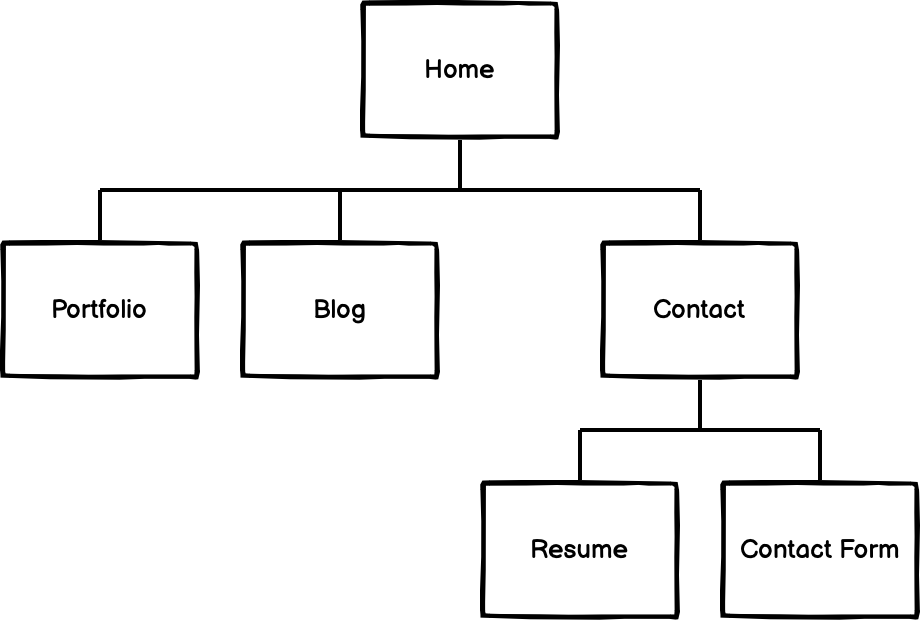

# Coder Academy - Portfolio Site
## Assignment 2 - Term 1 (A2T1)

[Here is my Portfolio site deployed through Netlify][1]

## Purpose
This portfolio was buit to showcase my work to potential clients and a source for anyone to get in contact with me.

## Tech Stack
I have used the following languages to build this site:
1. HTML5
1. CSS3
1. Javascript (ES6)

As well as deployment through Netlify using my [Github Repository.][2]
Version control was done with git.

## Functionality & Features

Here are some features I have added to my website:

1. Responsive top nav bar
1. CSS Grid for portfolio
1. Contact me form through Netlify
1. Sticky footer

## Sitemap

Here is my Sitemap

## Problems Faced

Turns out making a responsive top nav bar with media queries is harder then I first imagined.

## Technical Description & Set-up

There is no setup or dependancies required. Simply follow [the link][1] to view my portfolio on the web

## Authors

Ben Aitcheson - [My Github account][2]

## Acknowledgments

Thanks to the team at Coder Academy for their support.

Video tutorials used to contribute are:
1. [freeCodeCamp][3]
1. [Wes Bos][4]

[1]: https://priceless-jackson-e53021.netlify.app/
[2]: https://github.com/benaitcheson
[3]: https://www.freecodecamp.org/
[4]: https://wesbos.com/
